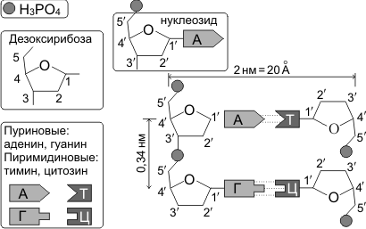

Строение и функции нуклеиновых кислот
===================================
К **нуклеиновым кислотам** относят высокополимерные соединения, распадающиеся при гидролизе на пуриновые и пиримидиновые основания, пентозу и фосфорную кислоту. Нуклеиновые кислоты содержат углерод, водород, фосфор, кислород и азот. Различают два класса нуклеиновых кислот: **рибонуклеиновые кислоты (РНК)** и **дезоксирибонуклеиновые кислоты (ДНК)**.

Строение и функции ДНК
--------

**ДНК** — полимер, мономерами которой являются дезоксирибонуклеотиды. Модель пространственного строения молекулы ДНК в виде двойной спирали была предложена в 1953 г. Дж. Уотсоном и Ф. Криком (для построения этой модели они использовали работы М. Уилкинса, Р. Франклин, Э. Чаргаффа).

**Молекула ДНК** образована двумя полинуклеотидными цепями, спирально закрученными друг около друга и вместе вокруг воображаемой оси, т.е. представляет собой двойную спираль (исключение — некоторые ДНК-содержащие вирусы имеют одноцепочечную ДНК). Диаметр двойной спирали ДНК — 2 нм, расстояние между соседними нуклеотидами — 0,34 нм, на один оборот спирали приходится 10 пар нуклеотидов. Длина молекулы может достигать нескольких сантиметров. Молекулярный вес — десятки и сотни миллионов. Суммарная длина ДНК ядра клетки человека — около 2 м. В эукариотических клетках ДНК образует комплексы с белками и имеет специфическую пространственную конформацию.

**Мономер ДНК** — нуклеотид (дезоксирибонуклеотид) — состоит из остатков трех веществ: 1) азотистого основания, 2) пятиуглеродного моносахарида (пентозы) и 3) фосфорной кислоты. Азотистые основания нуклеиновых кислот относятся к классам пиримидинов и пуринов. **Пиримидиновые основания ДНК** (имеют в составе своей молекулы одно кольцо) — тимин, цитозин. Пуриновые основания (имеют два кольца) — аденин и гуанин.

  
Моносахарид нуклеотида ДНК представлен дезоксирибозой.

Название нуклеотида является производным от названия соответствующего основания. Нуклеотиды и азотистые основания обозначаются заглавными буквами.

.. list-table:: 
   :widths: 75 75 75
   :class: longtable
   :header-rows: 1

   * - Азотистое основание
     - Название нуклеотида
     - Обозначение
   * - Аденин
     - Адениловый
     - А (A)
   * - Гуанин
     - Гуаниловый
     - Г (G)
   * - Тимин
     - Тимидиловый
     - Т (T)
   * - Цитозин
     - Цитидиловый
     - Ц (C)
     
Полинуклеотидная цепь образуется в результате реакций конденсации нуклеотидов. При этом между 3'-углеродом остатка дезоксирибозы одного нуклеотида и остатком фосфорной кислоты другого возникает **фосфоэфирная связь** (относится к категории прочных ковалентных связей). Один конец полинуклеотидной цепи заканчивается 5'-углеродом (его называют 5'-концом), другой — 3'-углеродом (3'-концом).

Против одной цепи нуклеотидов располагается вторая цепь. Расположение нуклеотидов в этих двух цепях не случайное, а строго определенное: против аденина одной цепи в другой цепи всегда располагается тимин, а против гуанина — всегда цитозин, между аденином и тимином возникают две водородные связи, между гуанином и цитозином — три водородные связи. Закономерность, согласно которой нуклеотиды разных цепей ДНК строго упорядоченно располагаются (аденин — тимин, гуанин — цитозин) и избирательно соединяются друг с другом, называется **принципом комплементарности**. Следует отметить, что Дж. Уотсон и Ф. Крик пришли к пониманию принципа комплементарности после ознакомления с работами Э. Чаргаффа. Э. Чаргафф, изучив огромное количество образцов тканей и органов различных организмов, установил, что в любом фрагменте ДНК содержание остатков гуанина всегда точно соответствует содержанию цитозина, а аденина — тимину (**«правило Чаргаффа»**), но объяснить этот факт он не смог.

Из принципа комплементарности следует, что последовательность нуклеотидов одной цепи определяет последовательность нуклеотидов другой.
Цепи ДНК антипараллельны (разнонаправлены), т.е. нуклеотиды разных цепей располагаются в противоположных направлениях, и, следовательно, напротив 3'-конца одной цепи находится 5'-конец другой. Молекулу ДНК иногда сравнивают с винтовой лестницей. «Перила» этой лестницы — сахарофосфатный остов (чередующиеся остатки дезоксирибозы и фосфорной кислоты); «ступени» — комплементарные азотистые основания.

**Функция ДНК** — хранение и передача наследственной информации.
