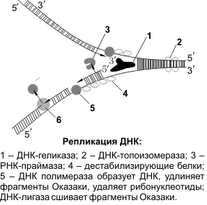
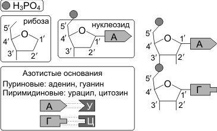
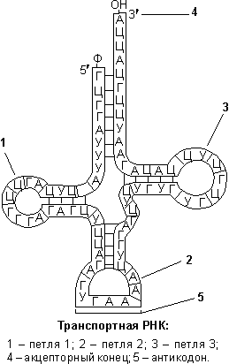

Строение и функции нуклеиновых кислот
======================
К **нуклеиновым кислотам** относят высокополимерные соединения, распадающиеся при гидролизе на пуриновые и пиримидиновые основания, пентозу и фосфорную кислоту. Нуклеиновые кислоты содержат углерод, водород, фосфор, кислород и азот. Различают два класса нуклеиновых кислот: **рибонуклеиновые кислоты (РНК)** и **дезоксирибонуклеиновые кислоты (ДНК)**.

Строение и функции ДНК
--------

**ДНК** — полимер, мономерами которой являются дезоксирибонуклеотиды. Модель пространственного строения молекулы ДНК в виде двойной спирали была предложена в 1953 г. Дж. Уотсоном и Ф. Криком (для построения этой модели они использовали работы М. Уилкинса, Р. Франклин, Э. Чаргаффа).

**Молекула ДНК** образована двумя полинуклеотидными цепями, спирально закрученными друг около друга и вместе вокруг воображаемой оси, т.е. представляет собой двойную спираль (исключение — некоторые ДНК-содержащие вирусы имеют одноцепочечную ДНК). Диаметр двойной спирали ДНК — 2 нм, расстояние между соседними нуклеотидами — 0,34 нм, на один оборот спирали приходится 10 пар нуклеотидов. Длина молекулы может достигать нескольких сантиметров. Молекулярный вес — десятки и сотни миллионов. Суммарная длина ДНК ядра клетки человека — около 2 м. В эукариотических клетках ДНК образует комплексы с белками и имеет специфическую пространственную конформацию.

**Мономер ДНК** — нуклеотид (дезоксирибонуклеотид) — состоит из остатков трех веществ: 1) азотистого основания, 2) пятиуглеродного моносахарида (пентозы) и 3) фосфорной кислоты. Азотистые основания нуклеиновых кислот относятся к классам пиримидинов и пуринов. 

**Пиримидиновые основания ДНК** (имеют в составе своей молекулы одно кольцо) — тимин, цитозин. Пуриновые основания (имеют два кольца) — аденин и гуанин.

.. image:: img/2/image1.png
  :width: 400
  :align: center
  
Моносахарид нуклеотида ДНК представлен дезоксирибозой.

Название нуклеотида является производным от названия соответствующего основания. Нуклеотиды и азотистые основания обозначаются заглавными буквами.

.. list-table:: 
   :widths: 75 75 75
   :class: longtable
   :header-rows: 1

   * - Азотистое основание
     - Название нуклеотида
     - Обозначение
   * - Аденин
     - Адениловый
     - А (A)
   * - Гуанин
     - Гуаниловый
     - Г (G)
   * - Тимин
     - Тимидиловый
     - Т (T)
   * - Цитозин
     - Цитидиловый
     - Ц (C)
     
Полинуклеотидная цепь образуется в результате реакций конденсации нуклеотидов. При этом между 3'-углеродом остатка дезоксирибозы одного нуклеотида и остатком фосфорной кислоты другого возникает **фосфоэфирная связь** (относится к категории прочных ковалентных связей). Один конец полинуклеотидной цепи заканчивается 5'-углеродом (его называют 5'-концом), другой — 3'-углеродом (3'-концом).

Против одной цепи нуклеотидов располагается вторая цепь. Расположение нуклеотидов в этих двух цепях не случайное, а строго определенное: против аденина одной цепи в другой цепи всегда располагается тимин, а против гуанина — всегда цитозин, между аденином и тимином возникают две водородные связи, между гуанином и цитозином — три водородные связи. Закономерность, согласно которой нуклеотиды разных цепей ДНК строго упорядоченно располагаются (аденин — тимин, гуанин — цитозин) и избирательно соединяются друг с другом, называется **принципом комплементарности**. Следует отметить, что Дж. Уотсон и Ф. Крик пришли к пониманию принципа комплементарности после ознакомления с работами Э. Чаргаффа. Э. Чаргафф, изучив огромное количество образцов тканей и органов различных организмов, установил, что в любом фрагменте ДНК содержание остатков гуанина всегда точно соответствует содержанию цитозина, а аденина — тимину (**«правило Чаргаффа»**), но объяснить этот факт он не смог.

Из принципа комплементарности следует, что последовательность нуклеотидов одной цепи определяет последовательность нуклеотидов другой.
Цепи ДНК антипараллельны (разнонаправлены), т.е. нуклеотиды разных цепей располагаются в противоположных направлениях, и, следовательно, напротив 3'-конца одной цепи находится 5'-конец другой. Молекулу ДНК иногда сравнивают с винтовой лестницей. «Перила» этой лестницы — сахарофосфатный остов (чередующиеся остатки дезоксирибозы и фосфорной кислоты); «ступени» — комплементарные азотистые основания.

**Функция ДНК** — хранение и передача наследственной информации.

Репликация (редупликация) ДНК
--------

**Репликация ДНК** — процесс самоудвоения, главное свойство молекулы ДНК. Репликация относится к категории реакций матричного синтеза, идет с участием ферментов. Под действием ферментов молекула ДНК раскручивается, и около каждой цепи, выступающей в роли матрицы, по принципам комплементарности и антипараллельности достраивается новая цепь. Таким образом, в каждой дочерней ДНК одна цепь является материнской, а вторая — вновь синтезированной. Такой способ синтеза называется **полуконсервативным**.

«Строительным материалом» и источником энергии для репликации являются **дезоксирибонуклеозидтрифосфаты** (АТФ, ТТФ, ГТФ, ЦТФ), содержащие три остатка фосфорной кислоты. При включении дезоксирибонуклеозидтрифосфатов в полинуклеотидную цепь два концевых остатка фосфорной кислоты отщепляются, и освободившаяся энергия используется на образование фосфодиэфирной связи между нуклеотидами.

  
В репликации участвуют следующие ферменты:
1. геликазы («расплетают» ДНК);
2. дестабилизирующие белки;
3. ДНК-топоизомеразы (разрезают ДНК);
4. ДНК-полимеразы (подбирают дезоксирибонуклеозидтрифосфаты и комплементарно присоединяют их к матричной цепи ДНК);
5. РНК-праймазы (образуют РНК-затравки, праймеры);
6. ДНК-лигазы (сшивают фрагменты ДНК).

С помощью геликаз в определенных участках ДНК расплетается, одноцепочечные участки ДНК связываются дестабилизирующими белками, образуется **репликационная вилка**. При расхождении 10 пар нуклеотидов (один виток спирали) молекула ДНК должна совершить полный оборот вокруг своей оси. Чтобы предотвратить это вращение ДНК-топоизомераза разрезает одну цепь ДНК, что дает ей возможность вращаться вокруг второй цепи.

ДНК-полимераза может присоединять нуклеотид только к 3'-углероду дезоксирибозы предыдущего нуклеотида, поэтому данный фермент способен передвигаться по матричной ДНК только в одном направлении: от 3'-конца к 5'-концу этой матричной ДНК. Так как в материнской ДНК цепи антипараллельны, то на ее разных цепях сборка дочерних полинуклеотидных цепей происходит по-разному и в противоположных направлениях. На цепи 3'–5' синтез дочерней полинуклеотидной цепи идет без перерывов; эта дочерняя цепь будет называться **лидирующей**. На цепи 5'–3' — прерывисто, фрагментами **(фрагменты Оказаки)**, которые после завершения репликации ДНК-лигазами сшиваются в одну цепь; эта дочерняя цепь будет **называться запаздывающей (отстающей)**.

Особенностью ДНК-полимеразы является то, что она может начинать свою работу только с «затравки» (праймера). Роль «затравок» выполняют короткие последовательности РНК, образуемые при участи фермента РНК-праймазы и спаренные с матричной ДНК. РНК-затравки после окончания сборки полинуклеотидных цепочек удаляются.
Репликация протекает сходно у прокариот и эукариот. Скорость синтеза ДНК у прокариот на порядок выше (1000 нуклеотидов в секунду), чем у эукариот (100 нуклеотидов в секунду). Репликация начинается одновременно в нескольких участках молекулы ДНК. Фрагмент ДНК от одной точки начала репликации до другой образует единицу репликации — репликон.

Репликация происходит перед делением клетки. Благодаря этой способности ДНК осуществляется передача наследственной информации от материнской клетки дочерним.
Особенностью ДНК-полимеразы является то, что она может начинать свою работу только с **«затравки» (праймера)**. Роль «затравок» выполняют короткие последовательности РНК, образуемые при участи фермента РНК-праймазы и спаренные с матричной ДНК. РНК-затравки после окончания сборки полинуклеотидных цепочек удаляются.

Репликация протекает сходно у прокариот и эукариот. Скорость синтеза ДНК у прокариот на порядок выше (1000 нуклеотидов в секунду), чем у эукариот (100 нуклеотидов в секунду). Репликация начинается одновременно в нескольких участках молекулы ДНК. Фрагмент ДНК от одной точки начала репликации до другой образует единицу репликации — **репликон**.

Репликация происходит перед делением клетки. Благодаря этой способности ДНК осуществляется передача наследственной информации от материнской клетки дочерним.

Репарация («ремонт»)
--------
Репарацией называется процесс устранения повреждений нуклеотидной последовательности ДНК. Осуществляется особыми ферментными системами клетки **(ферменты репарации)**. В процессе восстановления структуры ДНК можно выделить следующие этапы: 1) ДНК-репарирующие нуклеазы распознают и удаляют поврежденный участок, в результате чего в цепи ДНК образуется брешь; 2) ДНК-полимераза заполняет эту брешь, копируя информацию со второй («хорошей») цепи; 3) ДНК-лигаза «сшивает» нуклеотиды, завершая репарацию.

Наиболее изучены три механизма репарации: 1) фоторепарация, 2) эксцизная, или дорепликативная, репарация, 3) пострепликативная репарация.
Изменения структуры ДНК происходят в клетке постоянно под действием реакционно-способных метаболитов, ультрафиолетового излучения, тяжелых металлов и их солей и др. Поэтому дефекты систем репарации повышают скорость мутационных процессов, являются причиной наследственных заболеваний (пигментная ксеродерма, прогерия и др.).

Строение и функции РНК
--------

  
  
**РНК** — полимер, мономерами которой являются **рибонуклеотиды**. В отличие от ДНК, РНК образована не двумя, а одной полинуклеотидной цепочкой (исключение — некоторые РНК-содержащие вирусы имеют двухцепочечную РНК). Нуклеотиды РНК способны образовывать водородные связи между собой. Цепи РНК значительно короче цепей ДНК.
**Мономер РНК** — **нуклеотид (рибонуклеотид)** — состоит из остатков трех веществ: 1) азотистого основания, 2) пятиуглеродного моносахарида (пентозы) и 3) фосфорной кислоты. Азотистые основания РНК также относятся к классам пиримидинов и пуринов.

Пиримидиновые основания РНК — урацил, цитозин, пуриновые основания — аденин и гуанин. Моносахарид нуклеотида РНК представлен рибозой.

Выделяют **три вида РНК**: 1) **информационная** (матричная) РНК — иРНК (мРНК), 2) **транспортная** РНК — тРНК, 3) **рибосомная** РНК — рРНК.
Все виды РНК представляют собой неразветвленные полинуклеотиды, имеют специфическую пространственную конформацию и принимают участие в процессах синтеза белка. Информация о строении всех видов РНК хранится в ДНК. Процесс синтеза РНК на матрице ДНК называется транскрипцией.

  
**Транспортные РНК** содержат обычно 76 (от 75 до 95) нуклеотидов; молекулярная масса — 25 000–30 000. На долю тРНК приходится около 10% от общего содержания РНК в клетке. **Функции тРНК**: 1) транспорт аминокислот к месту синтеза белка, к рибосомам, 2) трансляционный посредник. В клетке встречается около 40 видов тРНК, каждый из них имеет характерную только для него последовательность нуклеотидов. Однако у всех тРНК имеется несколько внутримолекулярных комплементарных участков, из-за которых тРНК приобретают конформацию, напоминающую по форме лист клевера. У любой тРНК есть петля для контакта с рибосомой (1), антикодоновая петля (2), петля для контакта с ферментом (3), акцепторный стебель (4), антикодон (5). Аминокислота присоединяется к 3'-концу акцепторного стебля. **Антикодон** — три нуклеотида, «опознающие» кодон иРНК. Следует подчеркнуть, что конкретная тРНК может транспортировать строго определенную аминокислоту, соответствующую ее антикодону. Специфичность соединения аминокислоты и тРНК достигается благодаря свойствам фермента аминоацил-тРНК-синтетаза.

**Рибосомные РНК** содержат 3000–5000 нуклеотидов; молекулярная масса — 1 000 000–1 500 000. На долю рРНК приходится 80–85% от общего содержания РНК в клетке. В комплексе с рибосомными белками рРНК образует рибосомы — органоиды, осуществляющие синтез белка. В эукариотических клетках синтез рРНК происходит в ядрышках. **Функции рРНК**: 1) необходимый структурный компонент рибосом и, таким образом, обеспечение функционирования рибосом; 2) обеспечение взаимодействия рибосомы и тРНК; 3) первоначальное связывание рибосомы и кодона-инициатора иРНК и определение рамки считывания, 4) формирование активного центра рибосомы.

**Информационные РНК** разнообразны по содержанию нуклеотидов и молекулярной массе (от 50 000 до 4 000 000). На долю иРНК приходится до 5% от общего содержания РНК в клетке. **Функции иРНК**: 1) перенос генетической информации от ДНК к рибосомам, 2) матрица для синтеза молекулы белка, 3) определение аминокислотной последовательности первичной структуры белковой молекулы.

