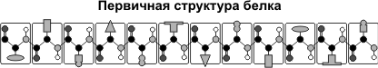
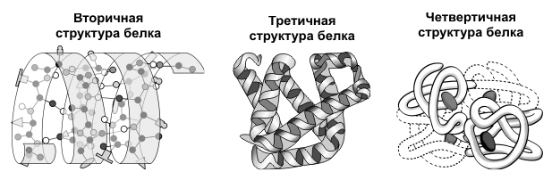

Строение белков
======================
**Белки** — высокомолекулярные органические соединения, состоящие из остатков α-аминокислот.
В **состав белков** входят углерод, водород, азот, кислород, сера. Часть белков образует комплексы с другими молекулами, содержащими фосфор, железо, цинк и медь.
Белки обладают большой молекулярной массой: яичный альбумин — 36 000, гемоглобин — 152 000, миозин — 500 000. Для сравнения: молекулярная масса спирта — 46, уксусной кислоты — 60, бензола — 78.

Аминокислотный состав белков
--------
**Белки** — непериодические полимеры, мономерами которых являются **α-аминокислоты**. Обычно в качестве мономеров белков называют 20 видов α-аминокислот, хотя в клетках и тканях их обнаружено свыше 170.
В зависимости от того, могут ли аминокислоты синтезироваться в организме человека и других животных, различают: **заменимые аминокислоты** — могут синтезироваться; **незаменимые аминокислоты** — не могут синтезироваться. Незаменимые аминокислоты должны поступать в организм вместе с пищей. Растения синтезируют все виды аминокислот.
В зависимости от аминокислотного состава, **белки бывают**: **полноценными** — содержат весь набор аминокислот; **неполноценными** — какие-то аминокислоты в их составе отсутствуют. Если белки состоят только из аминокислот, их называют **простыми**. Если белки содержат помимо аминокислот еще и неаминокислотный компонент (простетическую группу), их называют **сложными**. Простетическая группа может быть представлена металлами (металлопротеины), углеводами (гликопротеины), липидами (липопротеины), нуклеиновыми кислотами (нуклеопротеины).

  

Все **аминокислоты содержат**: 1) карбоксильную группу (–СООН), 2) аминогруппу (:math:`–NH_{2}`), 3) радикал или R-группу (остальная часть молекулы). Строение радикала у разных видов аминокислот — различное. В зависимости от количества аминогрупп и карбоксильных групп, входящих в состав аминокислот, различают: **нейтральные аминокислоты**, имеющие одну карбоксильную группу и одну аминогруппу; **основные аминокислоты**, имеющие более одной аминогруппы; **кислые аминокислоты**, имеющие более одной карбоксильной группы.
Аминокислоты являются **амфотерными соединениями**, так как в растворе они могут выступать как в роли кислот, так и оснований. В водных растворах аминокислоты существуют в разных ионных формах.

Пептидная связь
--------
**Пептиды** — органические вещества, состоящие из остатков аминокислот, соединенных пептидной связью.
Образование пептидов происходит в результате реакции конденсации аминокислот. При взаимодействии аминогруппы одной аминокислоты с карбоксильной группой другой между ними возникает ковалентная азот-углеродная связь, которую и называют **пептидной**. В зависимости от количества аминокислотных остатков, входящих в состав пептида, различают **дипептиды**, **трипептиды**, **тетрапептиды** и т.д. Образование пептидной связи может повторяться многократно. Это приводит к образованию **полипептидов**. На одном конце пептида находится свободная аминогруппа (его называют N-концом), а на другом — свободная карбоксильная группа (его называют С-концом).

.. image:: img/image3.png
  :width: 400
  :align: center

Пространственная организация белковых молекул
--------
Выполнение белками определенных специфических функций зависит от пространственной конфигурации их молекул, кроме того, клетке энергетически невыгодно держать белки в развернутой форме, в виде цепочки, поэтому полипептидные цепи подвергаются укладке, приобретая определенную трехмерную структуру, или конформацию. Выделяют 4 уровня **пространственной организации белков**.
**Первичная структура белка** — последовательность расположения аминокислотных остатков в полипептидной цепи, составляющей молекулу белка. Связь между аминокислотами — пептидная.

Если молекула белка состоит всего из 10 аминокислотных остатков, то число теоретически возможных вариантов белковых молекул, отличающихся порядком чередования аминокислот, — :math:`10^20`. Имея 20 аминокислот, можно составить из них еще большее количество разнообразных комбинаций. В организме человека обнаружено порядка десяти тысяч различных белков, которые отличаются как друг от друга, так и от белков других организмов.
Именно первичная структура белковой молекулы определяет свойства молекул белка и ее пространственную конфигурацию. Замена всего лишь одной аминокислоты на другую в полипептидной цепочке приводит к изменению свойств и функций белка. Например, замена в β-субъединице гемоглобина шестой глутаминовой аминокислоты на валин приводит к тому, что молекула гемоглобина в целом не может выполнять свою основную функцию — транспорт кислорода; в таких случаях у человека развивается заболевание — серповидноклеточная анемия.
**Вторичная структура** — упорядоченное свертывание полипептидной цепи в спираль (имеет вид растянутой пружины). Витки спирали укрепляются водородными связями, возникающими между карбоксильными группами и аминогруппами. Практически все СО- и NН-группы принимают участие в образовании водородных связей. Они слабее пептидных, но, повторяясь многократно, придают данной конфигурации устойчивость и жесткость. На уровне вторичной структуры существуют белки: фиброин (шелк, паутина), кератин (волосы, ногти), коллаген (сухожилия).

**Третичная структура** — укладка полипептидных цепей в глобулы, возникающая в результате возникновения химических связей (водородных, ионных, дисульфидных) и установления гидрофобных взаимодействий между радикалами аминокислотных остатков. Основную роль в образовании третичной структуры играют гидрофильно-гидрофобные взаимодействия. В водных растворах гидрофобные радикалы стремятся спрятаться от воды, группируясь внутри глобулы, в то время как гидрофильные радикалы в результате гидратации (взаимодействия с диполями воды) стремятся оказаться на поверхности молекулы. У некоторых белков третичная структура стабилизируется дисульфидными ковалентными связями, возникающими между атомами серы двух остатков цистеина. На уровне третичной структуры существуют ферменты, антитела, некоторые гормоны.

.. image:: img/image6.png
  :width: 400
  :align: center
 
**Четвертичная структура** характерна для сложных белков, молекулы которых образованы двумя и более глобулами. Субъединицы удерживаются в молекуле благодаря ионным, гидрофобным и электростатическим взаимодействиям. Иногда при образовании четвертичной структуры между субъединицами возникают дисульфидные связи. Наиболее изученным белком, имеющим четвертичную структуру, является **гемоглобин**. Он образован двумя α-субъединицами (141 аминокислотный остаток) и двумя β-субъединицами (146 аминокислотных остатков). С каждой субъединицей связана молекула гема, содержащая железо. Если по каким-либо причинам пространственная конформация белков отклоняется от нормальной, белок не может выполнять свои функции. Например, причиной «коровьего бешенства» (губкообразной энцефалопатии) является аномальная конформация прионов — поверхностных белков нервных клеток.

Свойства белков
--------
Аминокислотный состав, структура белковой молекулы определяют его **свойства**. Белки сочетают в себе основные и кислотные свойства, определяемые радикалами аминокислот: чем больше кислых аминокислот в белке, тем ярче выражены его кислотные свойства. Способность отдавать и присоединять :math:`Н^+` **определяют буферные свойства белков**; один из самых мощных буферов — гемоглобин в эритроцитах, поддерживающий рН крови на постоянном уровне. Есть белки растворимые (фибриноген), есть нерастворимые, выполняющие механические функции (фиброин, кератин, коллаген). Есть белки активные в химическом отношении (ферменты), есть химически неактивные, устойчивые к воздействию различных условий внешней среды и крайне неустойчивые.

Внешние факторы (нагревание, ультрафиолетовое излучение, тяжелые металлы и их соли, изменения рН, радиация, обезвоживание) могут вызывать нарушение структурной организации молекулы белка. Процесс утраты трехмерной конформации, присущей данной молекуле белка, называют **денатурацией**. Причиной денатурации является разрыв связей, стабилизирующих определенную структуру белка. 

Первоначально рвутся наиболее слабые связи, а при ужесточении условий и более сильные. Поэтому сначала утрачивается четвертичная, затем третичная и вторичная структуры. Изменение пространственной конфигурации приводит к изменению свойств белка и, как следствие, делает невозможным выполнение белком свойственных ему биологических функций. Если денатурация не сопровождается разрушением первичной структуры, то она может быть **обратимой**, в этом случае происходит самовосстановление свойственной белку конформации. Такой денатурации подвергаются, например, рецепторные белки мембраны. Процесс восстановления структуры белка после денатурации называется **ренатурацией**. Если восстановление пространственной конфигурации белка невозможно, то денатурация называется необратимой.

Функции белков
--------

.. list-table:: Функции белков
   :widths: 75 100
   :class: longtable
   :header-rows: 1

   * - Функция
     - Примеры и пояснения
   * - Строительная
     - Белки участвуют в образовании клеточных и внеклеточных структур: входят в состав клеточных мембран (липопротеины, гликопротеины), волос (кератин), сухожилий (коллаген) и т.д.
   * - Транспортная
     - Белок крови гемоглобин присоединяет кислород и транспортирует его от легких ко всем тканям и органам, а от них в легкие переносит углекислый газ; в состав клеточных мембран входят особые белки, которые обеспечивают активный и строго избирательный перенос некоторых веществ и ионов из клетки во внешнюю среду и обратно.
   * - Регуляторная
     - Гормоны белковой природы принимают участие в регуляции процессов обмена веществ. Например, гормон инсулин регулирует уровень глюкозы в крови, способствует синтезу гликогена, увеличивает образование жиров из углеводов.
   * - Защитная
     - В ответ на проникновение в организм чужеродных белков или микроорганизмов (антигенов) образуются особые белки — антитела, способные связывать и обезвреживать их. Фибрин, образующийся из фибриногена, способствует остановке кровотечений.
   * - Двигательная
     - Сократительные белки актин и миозин обеспечивают сокращение мышц у многоклеточных животных.
   * - Сигнальная
     - В поверхностную мембрану клетки встроены молекулы белков, способных изменять свою третичную структуру в ответ на действие факторов внешней среды, таким образом осуществляя прием сигналов из внешней среды и передачу команд в клетку.
   * - Запасающая
     - В организме животных белки, как правило, не запасаются, исключение: альбумин яиц, казеин молока. Но благодаря белкам в организме могут откладываться про запас некоторые вещества, например, при распаде гемоглобина железо не выводится из организма, а сохраняется, образуя комплекс с белком ферритином.
   * - Энергетическая
     - При распаде 1 г белка до конечных продуктов выделяется 17,6 кДж. Сначала белки распадаются до аминокислот, а затем до конечных продуктов — воды, углекислого газа и аммиака. Однако в качестве источника энергии белки используются только тогда, когда другие источники (углеводы и жиры) израсходованы.
   * - Каталитическая
     - Одна из важнейших функций белков. Обеспечивается белками — ферментами, которые ускоряют биохимические реакции, происходящие в клетках. Например, рибулезобифосфаткарбоксилаза катализирует фиксацию :math:`СО^2` при фотосинтезе.

Биосинтез белков
--------
Биосинтез белков является важнейшим процессом анаболизма. Все признаки, свойства и функции клеток и организмов определяются в конечном итоге белками. Белки недолговечны, время их существования ограничено. В каждой клетке постоянно синтезируются тысячи различных белковых молекул. В начале 50-х гг. ХХ в. Ф. Крик сформулировал центральную догму молекулярной биологии: ДНК → РНК → белок. Согласно этой догме способность клетки синтезировать определенные белки закреплена наследственно, информация о последовательности аминокислот в белковой молекуле закодирована в виде последовательности нуклеотидов ДНК. Участок ДНК, несущий информацию о первичной структуре конкретного белка, называется **геном**. Гены не только хранят информацию о последовательности аминокислот в полипептидной цепочке, но и кодируют некоторые виды РНК: рРНК, входящие в состав рибосом, и тРНК, отвечающие за транспорт аминокислот. В процессе биосинтеза белка выделяют два основных этапа: **транскрипция** — синтез РНК на матрице ДНК (гена) — и **трансляция** — синтез полипептидной цепи.

Генетический код и его свойства
--------
**Генетический код** — система записи информации о последовательности аминокислот в полипептиде последовательностью нуклеотидов ДНК или РНК. В настоящее время эта система записи считается расшифрованной.

**Свойства генетического кода**
----------------
1. триплетность: каждая аминокислота кодируется сочетанием из трех нуклеотидов (триплетом, кодоном);
2. однозначность (специфичность): триплет соответствует только одной аминокислоте;
3. вырожденность (избыточность): аминокислоты могут кодироваться несколькими (до шести) кодонами;
4. универсальность: система кодирования аминокислот одинакова у всех организмов Земли;
5. неперекрываемость: последовательность нуклеотидов имеет рамку считывания по 3 нуклеотида, один и тот же нуклеотид не может быть в составе двух триплетов;
6. из 64 кодовых триплетов 61 — кодирующие, кодируют аминокислоты, а 3 — бессмысленные (в РНК — УАА, УГА, УАГ), не кодируют аминокислоты. Они называются кодонами-терминаторами, поскольку блокируют синтез полипептида во время трансляции. Кроме того, есть кодон-инициатор (в РНК — АУГ), с которого трансляция начинается.

**Таблица генетического кода**
----------------

* Первый нуклеотид в триплете — один из четырех левого вертикального ряда, второй — один из верхнего горизонтального ряда, третий — из правого вертикального.

Реакции матричного синтеза
----------------
Это особая категория химических реакций, происходящих в клетках живых организмов. Во время этих реакций происходит синтез полимерных молекул по плану, заложенному в структуре других полимерных молекул-матриц. На одной матрице может быть синтезировано неограниченное количество молекул-копий. К этой категории реакций относятся репликация, транскрипция, трансляция и обратная транскрипция.

.. list-table:: 
   :widths: 50 50 95
   :class: longtable
   :header-rows: 1

   * - Название реакции матричного синтеза
     - Характеристика процесса
     - Основные компоненты
   * - Репликация
     - Синтез ДНК на матрице ДНК
     - Дезоксирибонуклеозидтрифосфаты, ферменты
   * - Транскрипция
     - Синтез РНК на матрице ДНК
     - Участок ДНК, рибонуклеозидтрифосфаты, ферменты
   * - Трансляция
     - Синтез полипептида на матрице РНК
     - Рибосомы, иРНК, аминокислоты, тРНК, АТФ, ГТФ, ферменты
   * - Обратная транскрипция
     - Синтез ДНК на матрице РНК
     - Дезоксирибонуклеозидтрифосфаты, ферменты
     
Строение гена эукариот
----------------
**Ген** — участок молекулы ДНК, кодирующий первичную последовательность аминокислот в полипептиде или последовательность нуклеотидов в молекулах транспортных и рибосомных РНК. ДНК одной хромосомы может содержать несколько тысяч генов, которые располагаются в линейном порядке. Место гена в определенном участке хромосомы называется **локусом**. Особенностями строения гена эукариот являются: 1) наличие достаточно большого количества регуляторных блоков, 2) мозаичность (чередование кодирующих участков с некодирующими). **Экзоны** (Э) — участки гена, несущие информацию о строении полипептида. **Интроны** (И) — участки гена, не несущие информацию о строении полипептида. Число экзонов и интронов различных генов разное; экзоны чередуются с интронами, общая длина последних может превышать длину экзонов в два и более раз. Перед первым экзоном и после последнего экзона находятся нуклеотидные последовательности, называемые соответственно лидерной (ЛП) и трейлерной последовательностью (ТП). Лидерная и трейлерная последовательности, экзоны и интроны образуют единицу транскрипции. **Промотор** (П) — участок гена, к которому присоединяется фермент РНК-полимераза, представляет собой особое сочетание нуклеотидов. Перед единицей транскрипции, после нее, иногда в интронах находятся регуляторные элементы (РЭ), к которым относятся **энхансеры и сайленсеры**. Энхансеры ускоряют транскрипцию, сайленсеры тормозят ее.

Транскрипция у эукариот
----------------
Транскрипция — синтез РНК на матрице ДНК. Осуществляется ферментом РНК-полимеразой.

РНК-полимераза может присоединиться только к промотору, который находится на 3'-конце матричной цепи ДНК, и двигаться только от 3'- к 5'-концу этой матричной цепи ДНК. Синтез РНК происходит на одной из двух цепочек ДНК в соответствии с принципами комплементарности и антипараллельности. Строительным материалом и источником энергии для транскрипции являются рибонуклеозидтрифосфаты (АТФ, УТФ, ГТФ, ЦТФ).

В результате транскрипции образуется «незрелая» иРНК (про-иРНК), которая проходит стадию созревания или процессинга. Процессинг включает в себя: 1) КЭПирование 5'-конца, 2) полиаденилирование 3'-конца (присоединение нескольких десятков адениловых нуклеотидов), 3) сплайсинг (вырезание интронов и сшивание экзонов). В зрелой иРНК выделяют КЭП, транслируемую область (сшитые в одно целое экзоны), нетранслируемые области (НТО) и полиадениловый «хвост».

.. image:: img/image8.png
  :width: 400
  :align: center

Транслируемая область начинается кодоном-инициатором, заканчивается кодонами-терминаторами. НТО содержат информацию, определяющую поведение РНК в клетке: срок «жизни», активность, локализацию.

Транскрипция и процессинг происходят в клеточном ядре. Зрелая иРНК приобретает определенную пространственную конформацию, окружается белками и в таком виде через ядерные поры транспортируется к рибосомам; иРНК эукариот, как правило, моноцистронны (кодируют только одну полипептидную цепь).

Трансляция
----------------
Трансляция — синтез полипептидной цепи на матрице иРНК.

Органоиды, обеспечивающие трансляцию, — рибосомы. У эукариот рибосомы находятся в некоторых органоидах — митохондриях и пластидах (70S-рибосомы), в свободном виде в цитоплазме (80S-рибосомы) и на мембранах эндоплазматической сети (80S-рибосомы). Таким образом, синтез белковых молекул может происходить в цитоплазме, на шероховатой эндоплазматической сети, в митохондриях и пластидах. В цитоплазме синтезируются белки для собственных нужд клетки; белки, синтезируемые на ЭПС, транспортируются по ее каналам в комплекс Гольджи и выводятся из клетки. В рибосоме выделяют малую и большую субъединицы. Малая субъединица рибосомы отвечает за генетические, декодирующие функции; большая — за биохимические, ферментативные.

В малой субъединице рибосомы расположен **функциональный центр** (ФЦР) с двумя участками — **пептидильным** (Р-участок) и **аминоацильным** (А-участок). В ФЦР может находиться шесть нуклеотидов иРНК, три — в пептидильном и три — в аминоацильном участках.

Для транспорта аминокислот к рибосомам используются транспортные РНК, тРНК. Длина тРНК от 75 до 95 нуклеотидных остатков. Они имеют третичную структуру, по форме напоминающую лист клевера. В тРНК различают антикодоновую петлю и акцепторный участок. В антикодоновой петле РНК имеется антикодон, комплементарный кодовому триплету определенной аминокислоты, а акцепторный участок на 3'-конце способен с помощью фермента аминоацил-тРНК-синтетазы присоединять именно эту аминокислоту (с затратой АТФ). Таким образом, у каждой аминокислоты есть свои тРНК и свои ферменты, присоединяющие аминокислоту к тРНК.

  
Двадцать видов аминокислот кодируются 61 кодоном, теоретически может быть 61 вид тРНК с соответствующими антикодонами. Но кодируемых аминокислот всего 20 видов, значит, у одной аминокислоты может быть несколько тРНК. Установлено существование нескольких тРНК, способных связываться с одним и тем же кодоном (последний нуклеотид в антикодоне тРНК не всегда важен), поэтому в клетке обнаружено всего около 40 различных тРНК.

.. image:: img/image11.png
  :width: 200
  :align: center

Синтез белка начинается с того момента, когда к 5'-концу иРНК присоединяется малая субъединица рибосомы, в Р-участок которой заходит метиониновая тРНК (транспортирующая аминокислоту метионин). Следует отметить, что любая полипептидная цепь на N-конце сначала имеет метионин, который в дальнейшем чаще всего отщепляется. Синтез полипептида идет от N-конца к С-концу, то есть пептидная связь образуется между карбоксильной группой первой и аминогруппой второй аминокислот.

Затем происходит присоединение большой субъединицы рибосомы, и в А-участок поступает вторая тРНК, чей антикодон комплементарно спаривается с кодоном иРНК, находящимся в А-участке.

Пептидилтрансферазный центр большой субъединицы катализирует образование пептидной связи между метионином и второй аминокислотой. Отдельного фермента, катализирующего образование пептидных связей, не существует. Энергия для образования пептидной связи поставляется за счет гидролиза ГТФ.

Как только образовалась пептидная связь, метиониновая тРНК отсоединяется от метионина, а рибосома передвигается на следующий кодовый триплет иРНК, который оказывается в А-участке рибосомы, а метиониновая тРНК выталкивается в цитоплазму. На один цикл расходуется 2 молекулы ГТФ. В А-участок заходит третья тРНК, и образуется пептидная связь между второй и третьей аминокислотами.

  
Трансляция идет до тех пор, пока в А-участок не попадает кодон-терминатор (УАА, УАГ или УГА), с которым связывается особый белковый фактор освобождения. Полипептидная цепь отделяется от тРНК и покидает рибосому. Происходит диссоциация, разъединение субъединиц рибосомы.

Скорость передвижения рибосомы по иРНК — 5–6 триплетов в секунду, на синтез белковой молекулы, состоящей из сотен аминокислотных остатков, клетке требуется несколько минут. Первым белком, синтезированным искусственно, был инсулин, состоящий из 51 аминокислотного остатка. Потребовалось провести 5000 операций, в работе в течение трех лет принимали участие 10 человек.

В трансляции можно выделить три стадии: а) инициации (образование иницаторного комплекса), б) элонгации (непосредственно «конвейер», соединение аминокислот друг с другом), в) терминации (образование терминирующего комплекса).

