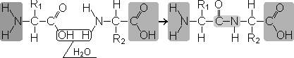

Пептидная связь
======================
**Пептиды** — органические вещества, состоящие из остатков аминокислот, соединенных пептидной связью.
Образование пептидов происходит в результате реакции конденсации аминокислот. При взаимодействии аминогруппы одной аминокислоты с карбоксильной группой другой между ними возникает ковалентная азот-углеродная связь, которую и называют **пептидной**. В зависимости от количества аминокислотных остатков, входящих в состав пептида, различают **дипептиды**, **трипептиды**, **тетрапептиды** и т.д. Образование пептидной связи может повторяться многократно. Это приводит к образованию **полипептидов**. На одном конце пептида находится свободная аминогруппа (его называют N-концом), а на другом — свободная карбоксильная группа (его называют С-концом).

