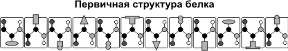
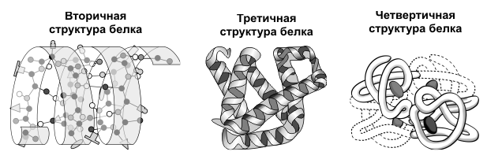
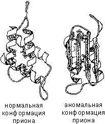

Пространственная организация белковых молекул
======================
Выполнение белками определенных специфических функций зависит от пространственной конфигурации их молекул, кроме того, клетке энергетически невыгодно держать белки в развернутой форме, в виде цепочки, поэтому полипептидные цепи подвергаются укладке, приобретая определенную трехмерную структуру, или конформацию. Выделяют 4 уровня **пространственной организации белков**.
**Первичная структура белка** — последовательность расположения аминокислотных остатков в полипептидной цепи, составляющей молекулу белка. Связь между аминокислотами — пептидная.

Если молекула белка состоит всего из 10 аминокислотных остатков, то число теоретически возможных вариантов белковых молекул, отличающихся порядком чередования аминокислот, — 1020. Имея 20 аминокислот, можно составить из них еще большее количество разнообразных комбинаций. В организме человека обнаружено порядка десяти тысяч различных белков, которые отличаются как друг от друга, так и от белков других организмов.
Именно первичная структура белковой молекулы определяет свойства молекул белка и ее пространственную конфигурацию. Замена всего лишь одной аминокислоты на другую в полипептидной цепочке приводит к изменению свойств и функций белка. Например, замена в β-субъединице гемоглобина шестой глутаминовой аминокислоты на валин приводит к тому, что молекула гемоглобина в целом не может выполнять свою основную функцию — транспорт кислорода; в таких случаях у человека развивается заболевание — серповидноклеточная анемия.
**Вторичная структура** — упорядоченное свертывание полипептидной цепи в спираль (имеет вид растянутой пружины). Витки спирали укрепляются водородными связями, возникающими между карбоксильными группами и аминогруппами. Практически все СО- и NН-группы принимают участие в образовании водородных связей. Они слабее пептидных, но, повторяясь многократно, придают данной конфигурации устойчивость и жесткость. На уровне вторичной структуры существуют белки: фиброин (шелк, паутина), кератин (волосы, ногти), коллаген (сухожилия).

**Третичная структура** — укладка полипептидных цепей в глобулы, возникающая в результате возникновения химических связей (водородных, ионных, дисульфидных) и установления гидрофобных взаимодействий между радикалами аминокислотных остатков. Основную роль в образовании третичной структуры играют гидрофильно-гидрофобные взаимодействия. В водных растворах гидрофобные радикалы стремятся спрятаться от воды, группируясь внутри глобулы, в то время как гидрофильные радикалы в результате гидратации (взаимодействия с диполями воды) стремятся оказаться на поверхности молекулы. У некоторых белков третичная структура стабилизируется дисульфидными ковалентными связями, возникающими между атомами серы двух остатков цистеина. На уровне третичной структуры существуют ферменты, антитела, некоторые гормоны.

 
**Четвертичная структура** характерна для сложных белков, молекулы которых образованы двумя и более глобулами. Субъединицы удерживаются в молекуле благодаря ионным, гидрофобным и электростатическим взаимодействиям. Иногда при образовании четвертичной структуры между субъединицами возникают дисульфидные связи. Наиболее изученным белком, имеющим четвертичную структуру, является **гемоглобин**. Он образован двумя α-субъединицами (141 аминокислотный остаток) и двумя β-субъединицами (146 аминокислотных остатков). С каждой субъединицей связана молекула гема, содержащая железо. Если по каким-либо причинам пространственная конформация белков отклоняется от нормальной, белок не может выполнять свои функции. Например, причиной «коровьего бешенства» (губкообразной энцефалопатии) является аномальная конформация прионов — поверхностных белков нервных клеток.
