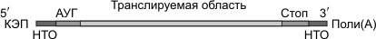

Транскрипция у эукариот
======================
Транскрипция — синтез РНК на матрице ДНК. Осуществляется ферментом РНК-полимеразой.

РНК-полимераза может присоединиться только к промотору, который находится на 3'-конце матричной цепи ДНК, и двигаться только от 3'- к 5'-концу этой матричной цепи ДНК. Синтез РНК происходит на одной из двух цепочек ДНК в соответствии с принципами комплементарности и антипараллельности. Строительным материалом и источником энергии для транскрипции являются рибонуклеозидтрифосфаты (АТФ, УТФ, ГТФ, ЦТФ).

В результате транскрипции образуется «незрелая» иРНК (про-иРНК), которая проходит стадию созревания или процессинга. Процессинг включает в себя: 1) КЭПирование 5'-конца, 2) полиаденилирование 3'-конца (присоединение нескольких десятков адениловых нуклеотидов), 3) сплайсинг (вырезание интронов и сшивание экзонов). В зрелой иРНК выделяют КЭП, транслируемую область (сшитые в одно целое экзоны), нетранслируемые области (НТО) и полиадениловый «хвост».

