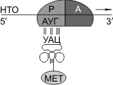

Трансляция
======================
Трансляция — синтез полипептидной цепи на матрице иРНК.

Органоиды, обеспечивающие трансляцию, — рибосомы. У эукариот рибосомы находятся в некоторых органоидах — митохондриях и пластидах (70S-рибосомы), в свободном виде в цитоплазме (80S-рибосомы) и на мембранах эндоплазматической сети (80S-рибосомы). Таким образом, синтез белковых молекул может происходить в цитоплазме, на шероховатой эндоплазматической сети, в митохондриях и пластидах. В цитоплазме синтезируются белки для собственных нужд клетки; белки, синтезируемые на ЭПС, транспортируются по ее каналам в комплекс Гольджи и выводятся из клетки. В рибосоме выделяют малую и большую субъединицы. Малая субъединица рибосомы отвечает за генетические, декодирующие функции; большая — за биохимические, ферментативные.

В малой субъединице рибосомы расположен **функциональный центр** (ФЦР) с двумя участками — **пептидильным** (Р-участок) и **аминоацильным** (А-участок). В ФЦР может находиться шесть нуклеотидов иРНК, три — в пептидильном и три — в аминоацильном участках.

Для транспорта аминокислот к рибосомам используются транспортные РНК, тРНК. Длина тРНК от 75 до 95 нуклеотидных остатков. Они имеют третичную структуру, по форме напоминающую лист клевера. В тРНК различают антикодоновую петлю и акцепторный участок. В антикодоновой петле РНК имеется антикодон, комплементарный кодовому триплету определенной аминокислоты, а акцепторный участок на 3'-конце способен с помощью фермента аминоацил-тРНК-синтетазы присоединять именно эту аминокислоту (с затратой АТФ). Таким образом, у каждой аминокислоты есть свои тРНК и свои ферменты, присоединяющие аминокислоту к тРНК.

.. image:: img/image88.png
  :width: 600
  :align: center
  
Двадцать видов аминокислот кодируются 61 кодоном, теоретически может быть 61 вид тРНК с соответствующими антикодонами. Но кодируемых аминокислот всего 20 видов, значит, у одной аминокислоты может быть несколько тРНК. Установлено существование нескольких тРНК, способных связываться с одним и тем же кодоном (последний нуклеотид в антикодоне тРНК не всегда важен), поэтому в клетке обнаружено всего около 40 различных тРНК.

Синтез белка начинается с того момента, когда к 5'-концу иРНК присоединяется малая субъединица рибосомы, в Р-участок которой заходит метиониновая тРНК (транспортирующая аминокислоту метионин). Следует отметить, что любая полипептидная цепь на N-конце сначала имеет метионин, который в дальнейшем чаще всего отщепляется. Синтез полипептида идет от N-конца к С-концу, то есть пептидная связь образуется между карбоксильной группой первой и аминогруппой второй аминокислот.

Затем происходит присоединение большой субъединицы рибосомы, и в А-участок поступает вторая тРНК, чей антикодон комплементарно спаривается с кодоном иРНК, находящимся в А-участке.

Пептидилтрансферазный центр большой субъединицы катализирует образование пептидной связи между метионином и второй аминокислотой. Отдельного фермента, катализирующего образование пептидных связей, не существует. Энергия для образования пептидной связи поставляется за счет гидролиза ГТФ.

Как только образовалась пептидная связь, метиониновая тРНК отсоединяется от метионина, а рибосома передвигается на следующий кодовый триплет иРНК, который оказывается в А-участке рибосомы, а метиониновая тРНК выталкивается в цитоплазму. На один цикл расходуется 2 молекулы ГТФ. В А-участок заходит третья тРНК, и образуется пептидная связь между второй и третьей аминокислотами.

.. image:: img/image13.png
  :width: 600
  :align: center
  
Трансляция идет до тех пор, пока в А-участок не попадает кодон-терминатор (УАА, УАГ или УГА), с которым связывается особый белковый фактор освобождения. Полипептидная цепь отделяется от тРНК и покидает рибосому. Происходит диссоциация, разъединение субъединиц рибосомы.

Скорость передвижения рибосомы по иРНК — 5–6 триплетов в секунду, на синтез белковой молекулы, состоящей из сотен аминокислотных остатков, клетке требуется несколько минут. Первым белком, синтезированным искусственно, был инсулин, состоящий из 51 аминокислотного остатка. Потребовалось провести 5000 операций, в работе в течение трех лет принимали участие 10 человек.

В трансляции можно выделить три стадии: а) инициации (образование иницаторного комплекса), б) элонгации (непосредственно «конвейер», соединение аминокислот друг с другом), в) терминации (образование терминирующего комплекса).
