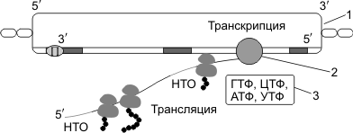

Транскрипция и трансляция у прокариот
======================

«Механизмы» сборки полинуклеотидных и полипептидных цепочек у прокариот и эукариот не различаются. Но в связи с тем, что гены прокариот не имеют экзонов и интронов (исключение — гены архебактерий), располагаются группами, и на эту группу генов приходится один промотор, появляются следующие особенности транскрипции и трансляции у прокариот.

1. В результате транскрипции образуется полицистронная иРНК, кодирующая несколько белков, совместно обеспечивающих определенную группу реакций.
2. иРНК имеет несколько центров инициации трансляции, терминации трансляции и НТО.
3. Не происходят КЭПирование, полиаденилирование и сплайсинг иРНК.
4. Трансляция начинается еще до завершения транскрипции; эти процессы не разделены во времени и пространстве, как это имеет место у эукариот.

.. centered:: 1 — ДНК; 2 — РНК-полимераза; 3 — Нуклеозидтрифосфаты ГТФ, ЦТФ, АТФ, УТФ.
